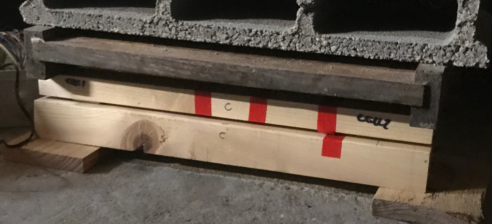
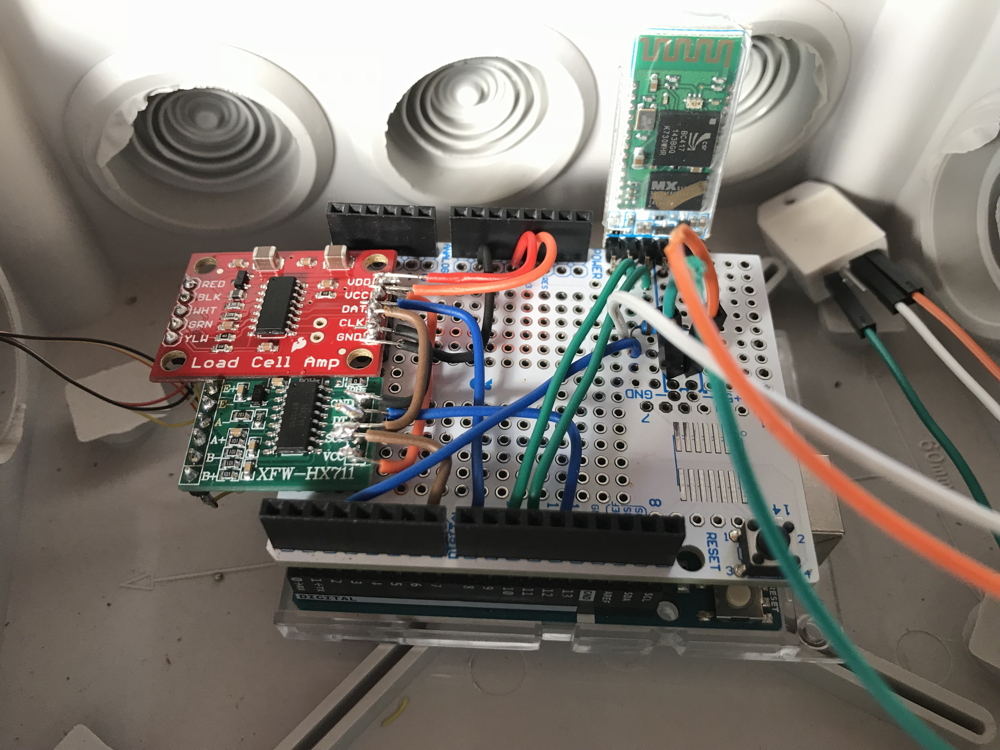

# Hivescale
This is the code for a bluetooth hivescale with a WiFi gateway

## Assemly of the scale (see picture)
- it is a single bar scale with two load cells embedded 

## Assemly of the electronics (see picture)
- an Arduino uno
- two HX711
- two load cells FX190
- bluetooth module HX05
- an humidity & temperature sensor DHT22

## Assemly of the gateway
- a raspberry pi 

## How it works
the load cells are connected to the arduino through the HX711
Arduino harvests data and sends it through bluetooth to the raspberry gateway that connects to the internet with WiFi sending data to HiveEyes server (see hiveeyes.org)

